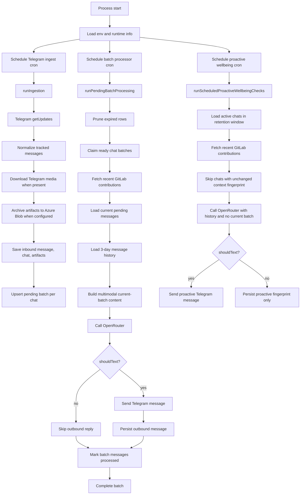

# Personal Telegram Bot System Flow

This document describes how the current bot runtime moves data from Telegram into local persistence, enriches it with GitLab activity, sends multimodal context to OpenRouter, and optionally replies back to Telegram. It also includes a user-journey view so the batching behavior is easier to understand from the chat side.

## Runtime Overview

The runtime is a cron-driven Node.js process started from `index.js`.

- `index.js` schedules three loops: Telegram ingestion, pending-batch processing, and proactive wellbeing evaluation.
- `services/telegram.js` fetches Telegram updates, normalizes messages, downloads file-backed media when needed, and sends replies.
- `services/persistence.js` stores chats, messages, artifacts, pending batches, and the last processed Telegram update id in SQLite.
- `services/storage.js` archives media to Azure Blob Storage and generates read URLs for model inputs.
- `services/context.js` formats recent conversation history and current-batch messages into prompt-friendly text.
- `services/media.js` converts current-batch artifacts into OpenRouter content parts such as text, image, generic file, and inline audio.
- `services/gitlab.js` fetches recent GitLab commits used as background context.
- `services/openrouter.js` builds the final model request and parses the JSON response.

## End-to-End Flow



  ## User Journey

  This section explains the same system from the user's point of view instead of the service point of view.

  ```mermaid
  sequenceDiagram
     actor User
     participant Telegram
     participant Ingest as Ingest Cron
     participant DB as SQLite
    participant Process as Batch Processor Cron
    participant Proactive as Proactive Cron
     participant AI as OpenRouter

     User->>Telegram: Send message or file
     Ingest->>Telegram: Poll getUpdates
     Ingest->>DB: Save inbound message and artifacts
     Ingest->>DB: Set process_after = now + batch delay

     User->>Telegram: Send another message before delay expires
     Ingest->>DB: Save next message
     Ingest->>DB: Move process_after forward again

     Note over DB: The bot waits until the user goes quiet long enough

     Process->>DB: Claim ready batch after process_after
     Process->>DB: Load current batch + recent history
     Process->>AI: Send GitLab JSON + history + current batch + artifacts
     AI-->>Process: JSON decision
     Process->>Telegram: Send reply when shouldText is true
     Process->>DB: Save outbound message and mark batch complete

      Proactive->>DB: Load recent chats with no pending batch work
      Proactive->>AI: Send GitLab JSON + retained history only
      AI-->>Proactive: JSON decision
      Proactive->>Telegram: Send proactive reply only when shouldText is true
  ```

  ### What the user experiences

  #### Journey A: User sends one message

  1. The user sends a message in Telegram.
  2. The next ingest tick stores it in SQLite and opens or updates that chat's pending batch.
  3. The bot does not answer immediately. It waits for the batch delay window to expire.
  4. When the processing cron sees that the batch is ready, it builds the full AI request.
  5. The request includes:
    - the current unprocessed batch for that chat
    - recent conversation history still inside the retention window
    - recent GitLab contribution data
    - any persisted artifacts that can be attached
  6. The model decides whether to send a Telegram reply.

  #### Journey B: User sends several messages in a short burst

  1. The first message starts a pending batch.
  2. Each new message arriving before the delay expires pushes `process_after` forward.
  3. The bot groups that burst into one AI call instead of replying message by message.
  4. When the user stops long enough, the batch becomes ready.
  5. The model then sees the entire unprocessed burst as the current batch, plus prior retained history and GitLab context.

  #### Journey C: User keeps chatting without a quiet gap

  1. The ingest cron keeps storing new inbound messages.
  2. The pending batch keeps being updated, so processing is deferred.
  3. No OpenRouter call is made until a processing tick finds that `process_after` has actually elapsed.
  4. When that finally happens, the request contains the still-pending current batch and the recent retained history outside that batch.

  ### Key timing rule

  The processing cron and the proactive cron now have separate jobs.

  - `TELEGRAM_PROCESS_CRON` controls how often the reactive processor wakes up to handle ready user batches.
  - `TELEGRAM_PROACTIVE_CRON` controls how often the bot considers initiating a message on its own.
  - The batch delay controls how long a chat must stay quiet before reactive AI processing is allowed.
  - Because of that split, the bot can stay responsive to fresh messages while being much slower and more human-like about unsolicited check-ins.

  ### Context included when a batch fires

  When a chat batch is finally processed, the model sees all of these inputs together:

  - the current batch of unprocessed inbound messages for that chat
  - retained conversation history, currently 3 days by default
  - GitLab contribution JSON for the configured lookback window
  - multimodal artifact inputs when available

  The current batch is removed from the history section before prompt assembly, so the same messages are not duplicated in both places.

## Detailed Flow

### 1. Startup and Scheduling

At startup, `index.js` loads environment variables, opens the SQLite runtime database through `services/persistence.js`, and registers two cron jobs.

- `TELEGRAM_POLL_CRON` defaults to `* * * * *`.
- `TELEGRAM_PROCESS_CRON` defaults to `* * * * *`.
- `TELEGRAM_PROACTIVE_CRON` defaults to `*/30 * * * *`.
- The runtime database defaults to `.runtime/personal-telegram-bot.sqlite`.
- Simple in-memory guards prevent overlapping ingest and processing runs in the same process.

### 2. Telegram Ingestion

Each ingest tick runs `ingestUpdates(batchDelayMs)`.

1. The runtime prunes expired rows before processing new input.
2. The bot reads the last processed Telegram `update_id` from SQLite.
3. It calls Telegram `getUpdates` with an offset of `lastUpdateId + 1`.
4. Only message updates are considered.
5. If `TELEGRAM_USERNAME` is configured, only messages from or for that username are tracked.
6. Each tracked update is normalized into a consistent internal message shape.

Normalized message fields include:

- chat identity and display name
- Telegram message id and update id
- sender metadata
- whether the sender is a bot
- detected message type such as `text`, `photo`, `document`, `voice`, `audio`, `video`, `sticker`, `location`, or `contact`
- extracted text or a readable fallback summary
- reply target id if present
- occurrence timestamp
- collected artifact metadata

### 3. Artifact Handling

When an inbound Telegram message contains file-backed media, the ingest path extracts artifact descriptors and attempts to archive them.

1. `services/telegram.js` resolves the Telegram file metadata and downloads the binary.
2. `services/storage.js` derives a summary-based filename from the message text.
3. The artifact is assigned a blob path in the form `YYYY-MM-DD/<summary>--<uniqueId>.<ext>`.
4. If Azure Blob Storage is configured, the binary is uploaded to the container.
5. If Azure is not configured, the artifact is still persisted with upload status metadata so the bot keeps a durable record.

Current storage behavior:

- storage provider: Azure Blob Storage
- default container name: `personal-experiment`
- upload status examples: `uploaded`, `unconfigured`, `download_failed`, `upload_failed`

### 4. Persistence and Batching

The normalized inbound message is stored in SQLite by `saveInboundMessage(...)`.

Persistence currently keeps:

- `app_state` for values such as the last processed Telegram update id
- `chats` for chat metadata
- `messages` for inbound and outbound conversation records
- `artifacts` for persisted media metadata and archival state
- `pending_batches` for per-chat delayed processing windows

Each saved inbound message updates a pending batch for its chat.

- The default batch delay is 2 minutes.
- New messages push `process_after` forward so quick bursts are grouped into one AI call.
- Outbound bot messages are also persisted, but they are marked processed immediately.

### 5. Pending Batch Processing

Each processing tick runs `runPendingBatchProcessing()`.

1. Expired messages and stale batches are pruned first.
2. Ready chat batches are claimed from SQLite so only pending windows whose `process_after` has elapsed are processed.
3. Recent GitLab contributions are fetched once for the tick.
4. For each claimed batch, the bot loads:
   - current unprocessed inbound messages for that chat
   - recent conversation history within the retention window
5. If the batch has no pending messages left, it is completed and removed.
6. Otherwise the bot assembles the AI request and asks OpenRouter whether it should reply.

If a chat batch fails during processing, it is rescheduled instead of being dropped.

### 6. Proactive Wellbeing Processing

The proactive loop runs on its own cron instead of sharing the reactive batch processor schedule.

1. Expired rows are pruned before evaluation.
2. The bot loads chats with recent history inside the retention window.
3. It fetches recent GitLab contributions for the tick.
4. Chats with pending inbound batches are skipped so proactive outreach does not compete with reactive replies.
5. Chats whose inbound-history-plus-contribution fingerprint has not changed are skipped.
6. For the remaining chats, the bot calls OpenRouter with retained history and an empty current batch.
7. If the model decides to text, the bot sends the proactive reply and then stores the latest context fingerprint.

### 7. Prompt and Multimodal Assembly

The AI request is split into two major context sources.

System prompt content:

- GitLab activity as JSON
- working schedule placeholder text
- recent 3-day conversation history formatted as timestamped `user` and `assistant` lines
- instructions to return only JSON with `shouldText` and `text`

User message content:

- a text preface for the current batch
- one formatted line per current-batch message
- multimodal artifact parts when available

Artifact-to-model mapping in `services/media.js`:

- images are sent as `image` parts using signed Azure URLs
- uploaded non-audio files are sent as `file` parts using signed Azure URLs
- audio and voice are downloaded from Telegram again at processing time and sent inline as binary `file` parts because OpenRouter audio inputs cannot use remote URLs
- when an artifact cannot be attached, a text fallback is appended so the model still sees that the artifact existed

### 8. OpenRouter Decision Step

`services/openrouter.js` sends the assembled request to OpenRouter using the `deepseek/deepseek-chat-v3.1` model.

Expected model output:

```json
{
  "shouldText": true,
  "text": "Message to send back to Telegram"
}
```

The bot strips any surrounding Markdown fences, parses the JSON, and uses `shouldText` to decide whether to respond.

### 9. Telegram Reply and Outbound Logging

When the model decides to reply:

1. `services/telegram.js` calls Telegram `sendMessage`.
2. The sent message is normalized like other messages.
3. The outbound message is saved in SQLite so later prompts include the bot's own conversation history.
4. The just-processed inbound batch messages are marked with `processed_at`.
5. The pending batch row is deleted.

When the model decides not to reply:

1. No Telegram message is sent.
2. The inbound messages are still marked processed.
3. The pending batch row is deleted.

## Retention and Recovery Behavior

The persistence layer keeps a rolling history window.

- default retention is 3 days
- expired message rows are pruned during ingest and processing ticks
- old pending batches are also pruned
- stale `processing` batches are reset back to `pending` after a timeout so the system can recover from interrupted runs

## External Integrations

### Telegram

- reads inbound updates via `getUpdates`
- downloads media via `getFile` plus Telegram file URLs
- sends outbound text via `sendMessage`

### Azure Blob Storage

- stores archived media artifacts when configured
- provides signed read URLs for image and generic file model inputs

### GitLab

- fetches recent commit activity for the configured user
- contribution data is passed to the model as JSON, not as a prose summary

### OpenRouter

- receives the system prompt, recent history, current batch, and multimodal parts
- returns a JSON decision describing whether the bot should text the user

## Important Runtime Configuration

- `TELEGRAM_BOT_TOKEN`: required for Telegram API access
- `TELEGRAM_USERNAME`: optional filter for tracked messages
- `TELEGRAM_FETCH_LIMIT`: maximum updates requested per poll
- `TELEGRAM_POLL_CRON`: ingest schedule
- `TELEGRAM_PROCESS_CRON`: reactive batch-processing schedule
- `TELEGRAM_PROACTIVE_CRON`: proactive wellbeing schedule
- `OPENROUTER_API_KEY`: required for AI calls
- `GITLAB_TOKEN`, `GITLAB_USERNAME`, `GITLAB_HOST`: GitLab integration settings
- `GITLAB_LOOKBACK_DAYS`: contribution lookback window, default `1`
- `AZURE_STORAGE_CONNECTION_STRING`: enables artifact upload and signed URLs
- `AZURE_STORAGE_CONTAINER_NAME`: optional container override, default `personal-experiment`
- `RUNTIME_DATA_DIR`: optional runtime directory override

## Current System Notes

- Conversation history sent to the model excludes the current unprocessed batch so the same messages are not duplicated in both history and current inputs.
- The model sees artifact summaries in the text history even when full multimodal attachment is unavailable.
- Audio and voice are the only artifact types fetched inline from Telegram during processing; other uploaded artifacts are referenced through signed Azure URLs.
- Structured Telegram types such as location, venue, contact, and poll are currently represented through text summaries rather than dedicated structured model parts.