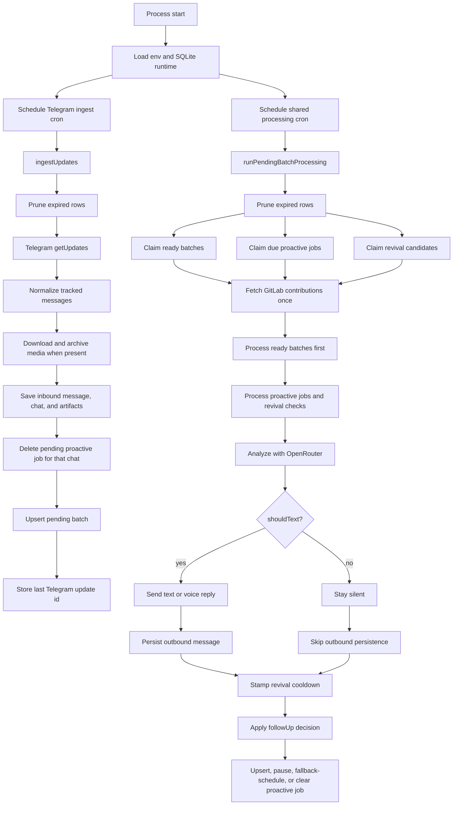

# Personal Telegram Bot System Flow

This document describes the runtime as it exists in the codebase today. The bot ingests Telegram messages into SQLite, batches nearby inbound activity, enriches the model prompt with retained conversation history and GitLab activity, asks OpenRouter for both an immediate reply decision and a future follow-up decision, and can deliver the result back to Telegram as either text or a native voice note. Proactive behavior is driven entirely by queued rows in SQLite plus a revival-claim path for silent chats. There is no separate proactive cron.

## Runtime Summary

- `index.js` starts two cron loops: Telegram ingestion and one shared processing worker.
- `services/persistence.js` is the source of truth for chats, messages, artifacts, batches, proactive jobs, and revival cooldown state.
- `services/telegram.js` polls Telegram, normalizes inbound updates, archives media when possible, and sends outbound text or voice replies.
- `services/openrouter.js` builds the chat-analysis request, passes scheduling context, normalizes the JSON decision, and archives the full request log.
- `services/speech.js` calls the OpenRouter speech endpoint, logs the request, and returns audio that is later converted to Telegram OGG/Opus.
- `services/storage.js` handles Azure Blob uploads for both artifacts and request logs, and generates read URLs for model inputs when possible.
- `services/gitlab.js` fetches recent GitLab contribution activity once per processing tick.
- `services/time.js` formats AI-facing timestamps in Indonesian local time (`WIB`).

## High-Level Flow



## Core Runtime Roles

- `index.js`: scheduler and orchestrator for ingestion, shared processing, follow-up scheduling, hybrid fallback, and recovery rescheduling.
- `services/persistence.js`: SQLite schema, transactional message writes, batch claiming, proactive job claiming, revival candidate claiming, stale-row resets, and retention pruning.
- `services/telegram.js`: Telegram API integration, inbound normalization, artifact download, text chunking, voice-note delivery, and outbound persistence.
- `services/media.js`: converts current-batch text and artifacts into OpenRouter-friendly content parts.
- `services/context.js`: builds the retained conversation snapshot used in prompts.
- `services/openrouter.js`: chat prompt construction, scheduling-context formatting, output normalization, and OpenRouter chat request-log archival.
- `services/speech.js`: OpenRouter speech synthesis, supported voice resolution, and speech request-log archival.
- `services/storage.js`: Azure Blob upload and read-URL support for artifacts and archived logs.

## SQLite State and Queue Ownership

The runtime uses SQLite as both persistence and the queueing boundary.

- `app_state`: stores general runtime state such as `telegram.last_update_id` and per-chat revival cooldown markers in the form `proactive.revival.last_checked.<chatId>`.
- `chats`: one row per Telegram chat with display metadata.
- `messages`: inbound and outbound conversation history.
- `artifacts`: persisted metadata for file-backed Telegram media and its archival state.
- `pending_batches`: one delayed reactive-processing row per chat.
- `proactive_jobs`: one proactive job row per chat, with `due_at`, `requested_delay_minutes`, `reason`, `source`, and `status`.

Important ownership rules:

- `pending_batches.chat_id` is unique, so one chat has at most one active reactive batch window.
- `proactive_jobs.chat_id` is unique, so one chat has at most one active proactive job.
- New inbound activity deletes that chat's proactive job before rescheduling the reactive batch.
- SQLite row claims, not just in-memory flags, are the real concurrency boundary for work ownership.

## End-to-End Runtime Flow

### 1. Startup and Scheduling

At startup, `index.js` loads environment variables, opens the SQLite runtime database through `services/persistence.js`, and registers two cron jobs.

- `TELEGRAM_POLL_CRON` drives Telegram ingestion.
- `TELEGRAM_PROCESS_CRON` drives the single shared worker for reactive batches, due proactive jobs, and revival checks.
- The runtime database defaults to `.runtime/personal-telegram-bot.sqlite`.
- `ingestionInProgress` and `processingInProgress` prevent overlapping runs inside the same Node.js process.

### 2. Telegram Ingestion

Each ingest tick runs `ingestUpdates(batchDelayMs)`.

1. The runtime prunes expired rows.
2. The bot loads the last processed Telegram `update_id` from SQLite.
3. It calls Telegram `getUpdates` with `allowed_updates: ['message']` and an offset of `lastUpdateId + 1` when available.
4. If `TELEGRAM_USERNAME` is configured, only matching updates are tracked.
5. Each tracked update is normalized into a consistent internal payload.
6. File-backed media is downloaded and turned into artifact descriptors.
7. `saveInboundMessage(...)` writes the chat row, message row, and artifact rows in one transaction.
8. That same transaction deletes any proactive job for the chat and upserts the batch row with a new `process_after` time.
9. The newest Telegram `update_id` seen during the tick is written back to `app_state`.

Inbound normalization captures:

- chat identity and display metadata
- Telegram message id and update id
- sender metadata
- whether the sender is a bot
- message type such as `text`, `photo`, `document`, `voice`, `audio`, `video`, `sticker`, `location`, or `contact`
- extracted text content or a readable fallback summary
- reply target id when present
- occurrence timestamp
- artifact metadata when media is involved

### 3. Artifact Handling and Storage

When Telegram media is present, the ingest path attempts archival.

1. Telegram file metadata is resolved and the binary is downloaded.
2. `services/storage.js` derives a summary-based filename from the message text and media type.
3. The blob path is built as `YYYY-MM-DD/<derivedFileName>`.
4. If Azure Blob Storage is configured, the binary is uploaded.
5. If Azure is not configured, the artifact is still persisted with an `uploadStatus` such as `unconfigured`, `download_failed`, or `upload_failed`.

Additional storage notes:

- default container name is `personal-experiment`
- artifact records stay in SQLite even when upload is unavailable
- signed or direct read URLs are later used for model inputs when possible
- `services/storage.js` seeds `global.crypto` from Node's `webcrypto` before loading the Azure SDK so uploads work correctly in the current runtime

### 4. Shared Processing Worker

Each processing tick runs `runPendingBatchProcessing()`.

1. The runtime prunes expired rows again.
2. Ready reactive batches are claimed from SQLite.
3. Due proactive jobs are claimed from SQLite.
4. Silent-chat revival candidates are claimed from SQLite.
5. If nothing is ready, the worker exits.
6. Recent GitLab contributions are fetched once for the entire tick.
7. Ready batches are processed first.
8. Claimed proactive work is processed second.
9. If the entire tick throws unexpectedly, claimed batches and proactive jobs are rescheduled instead of being dropped.

This is the only worker that processes proactive behavior. There is no dedicated proactive cron or background scanner outside this loop.

### 5. Reactive Batch Path

For each claimed batch:

1. The worker loads the current unprocessed inbound messages for that chat.
2. If the batch is already empty, it completes the batch without an AI call.
3. Otherwise it loads retained history for the chat.
4. It builds multimodal current-batch content from the pending messages and their artifacts.
5. It calls OpenRouter with `analysisTrigger = 'batch'`.
6. If `shouldText` is true and `text` is non-empty, it sends the outbound Telegram reply.
7. The inbound batch messages are marked processed.
8. The pending batch row is deleted.
9. The normalized `followUp` decision is applied to proactive scheduling.

The current unprocessed batch is removed from the history section before prompt assembly so the same messages are not duplicated in both prompt sections.

### 6. Due Proactive Follow-Up Path

For each claimed proactive job:

1. The worker checks whether new inbound messages are now pending for that chat.
2. If a reactive batch is waiting, the proactive job is deleted so reactive processing wins.
3. If no retained history exists, the proactive job is deleted.
4. Otherwise the worker loads retained history and GitLab activity.
5. It calls OpenRouter with `analysisTrigger = 'scheduled_follow_up'` and the stored scheduling context.
6. If `shouldText` is true and `text` is non-empty, it sends the proactive reply.
7. It stamps the revival cooldown marker in `app_state` before the proactive job can be cleared or replaced.
8. It applies the normalized `followUp` decision.
9. If processing fails, the proactive job is rescheduled back to `pending` with a short retry delay.

### 7. Revival Bootstrap Path

The revival path exists for chats that have no active proactive chain but should still be reconsidered after long silence or after downtime.

`claimRevivalProactiveJobs(...)` selects candidate chats only when all of these are true:

- the chat still has retained message history inside `MESSAGE_RETENTION_DAYS`
- no `pending_batches` row exists for that chat
- no `proactive_jobs` row exists for that chat
- the last retained message is older than `TELEGRAM_PROACTIVE_REVIVAL_SILENCE_MINUTES`
- the per-chat revival marker is missing or older than `TELEGRAM_PROACTIVE_REVIVAL_COOLDOWN_MINUTES`

Each candidate is then claimed by inserting a `proactive_jobs` row with:

- `source = 'revival_check'`
- `status = 'processing'`
- `requested_delay_minutes = 0`
- `due_at = now`

The claim uses `INSERT OR IGNORE` plus `NOT EXISTS` checks against both `proactive_jobs` and `pending_batches`, so two workers do not cold-start the same chat at once.

Once claimed, revival work reuses the normal proactive processing path with one difference: the OpenRouter prompt receives `analysisTrigger = 'revival_check'` so the model knows this is a fresh re-evaluation, not just another unanswered scheduled follow-up.

Practical outcome:

- if the model wants to message now, the revival check can restart proactive outreach immediately
- if the timing is bad, it can stay silent and schedule a better-timed follow-up
- if nothing should happen, the evaluation can end quietly and the cooldown prevents instant re-claim on the next tick

### 8. Follow-Up Decision Semantics

OpenRouter returns a `followUp` object with `shouldSchedule`, `delayMinutes`, `reason`, and `stopChain`.

The server interprets that object like this:

- `shouldSchedule = true` and `delayMinutes >= 1`: upsert a proactive job for the chat using the returned delay.
- `shouldSchedule = false`, `stopChain = true`, and `delayMinutes >= 1`: pause the proactive chain by scheduling a future wake-up with source `scheduled_follow_up_pause`.
- `shouldSchedule = false`, `stopChain = true`, and `delayMinutes = 0`: end the proactive chain completely.
- `shouldSchedule = false` and `stopChain = false` after a proactive-style evaluation that actually sent a reply: the server may schedule a hybrid fallback follow-up using `TELEGRAM_PROACTIVE_SILENCE_FALLBACK_MINUTES`.
- otherwise: clear any existing proactive job.

Hybrid fallback details:

- it only applies after proactive-style evaluations, not reactive batch processing
- it only applies when an outbound proactive reply was sent
- it uses the larger of the previous requested delay and `TELEGRAM_PROACTIVE_SILENCE_FALLBACK_MINUTES`
- it stores source `scheduled_follow_up_fallback`

Important nuance: revival-triggered evaluations are processed through the same proactive follow-up machinery, so a revival reply can transition directly into the normal follow-up chain and fallback behavior.

### 9. Prompt Construction and Model Contract

`services/openrouter.js` currently uses the `google/gemini-3-flash-preview` chat model.

The system prompt includes:

- GitLab activity as raw JSON
- the current Indonesian date and time
- scheduling context derived from `analysisTrigger`
- a working-schedule placeholder, which is currently passed as an empty string and rendered as `Nothing found`
- retained conversation history formatted as timestamped `user` and `assistant` lines
- a rule that all displayed timestamps are already in Indonesian local time (`WIB`)
- explicit JSON-output instructions for `shouldText`, `text`, `mood`, and `followUp`
- rules for keeping unanswered proactive chains alive, pausing them, ending them, or handling revival checks conservatively

Scheduling context varies by trigger:

- `batch`: triggered by newly queued user input
- `scheduled_follow_up`: triggered because a previously scheduled proactive job became due and no new inbound user message arrived first
- `revival_check`: triggered because no chain is active and the chat has been silent long enough to re-evaluate

User content includes:

- a text framing block for the current batch
- one formatted line per current-batch message
- multimodal artifact parts when they can be attached

Artifact-to-model mapping in `services/media.js`:

- images are attached as image parts using Azure read URLs when possible
- generic uploaded files are attached as file parts using Azure read URLs when possible
- audio and voice artifacts are re-downloaded and attached inline because remote audio URLs are not used for OpenRouter audio inputs here
- if an artifact cannot be attached, text fallback content is appended so the model still knows the artifact existed

Normalized output shape:

```json
{
  "shouldText": true,
  "text": "Message to send back to Telegram",
  "mood": "empathetic",
  "followUp": {
    "shouldSchedule": true,
    "delayMinutes": 45,
    "reason": "Check back later if the conversation stays quiet",
    "stopChain": false
  }
}
```

The bot strips Markdown fences, parses JSON, normalizes malformed values, and only treats `shouldText` as true when a non-empty `text` string survives normalization.

### 10. Telegram Delivery and Voice Notes

When the model decides to reply, `sendTelegramMessage(...)` chooses between text and voice delivery.

Text delivery:

- long replies are split into Telegram-safe chunks
- each chunk is sent with `sendMessage`
- chunk spacing is controlled by `TELEGRAM_CHUNK_DELAY_MS`
- each outbound chunk is normalized and persisted to SQLite

Voice delivery:

- voice mode is selected probabilistically by `TELEGRAM_VOICE_REPLY_CHANCE` unless overridden in code
- the text is still chunked first, so long voice replies may become multiple voice notes
- `services/speech.js` calls the OpenRouter speech endpoint
- `buildSpeechInstructions(...)` merges optional base instructions with the analysis `mood`
- the speech response is converted to Telegram-friendly OGG/Opus with ffmpeg before `sendVoice`
- the spoken transcript is persisted as `messages.text_content` so future prompts still see the bot's own words
- if voice delivery fails, the bot falls back to text for that reply path

### 11. Observability and Archived Request Logs

Observability is intentionally best-effort. Logging failures should not stop the main bot flow.

Debug logging:

- `DEBUG_LOGS=true` enables structured debug logging across scheduler, Telegram, GitLab, OpenRouter, speech, and storage paths

Archived request logs:

- OpenRouter chat-analysis logs are archived under `request-logs/openrouter-chat`
- speech-synthesis logs are archived under `request-logs/openrouter-speech`
- archived chat logs include the full prompt, request messages, scheduling context, raw response text, normalized parsed result, and error details when present
- archived speech logs include model, requested and resolved voice, input text, instructions, payload, response metadata, and error details when present
- if Azure Blob Storage is not configured, the archival helpers still return a log record with `uploadStatus = 'unconfigured'`
- if upload fails, the failure is logged, but the chat or speech request itself is not retried solely because the log upload failed

### 12. Recovery, Precedence, and Race Handling

The runtime handles overlap and interrupted work in several layers.

- per-process flags prevent overlapping ingest ticks and overlapping processing ticks inside one Node.js process
- SQLite claim/update operations determine actual work ownership for batches and proactive jobs
- fresh inbound user activity cancels the chat's pending proactive job before the new batch window is written
- ready reactive batches are processed before proactive work in the same tick
- if a proactive job notices pending inbound messages, it clears itself so the reactive path wins
- stale `processing` batches are reset back to `pending`
- stale `processing` proactive jobs are reset back to `pending`
- revival cooldown is stamped before follow-up cleanup or rescheduling so a completed proactive evaluation cannot immediately be re-claimed as a fresh revival check in the delete gap
- revival only works while retained history still exists, so a chat older than the retention window cannot be revived from history alone

## User-Facing Behavior Scenarios

### User sends a short burst of messages

1. The first inbound message creates or updates `pending_batches`.
2. Every new inbound message during the quiet window moves `process_after` forward.
3. Once the user stops long enough, the shared worker claims the batch and makes one AI call for the whole burst.

### AI schedules a proactive follow-up

1. A batch or proactive evaluation returns `followUp.shouldSchedule = true`.
2. The server upserts one row in `proactive_jobs` for that chat.
3. The shared worker later claims that row when `due_at` arrives.

### AI pauses until later instead of ending the chain

1. The model returns `stopChain = true` with a positive `delayMinutes`.
2. The server schedules a future wake-up instead of permanently ending the chain.
3. When that wake-up arrives, the same proactive evaluation path runs again.

### User replies before the proactive job fires

1. Ingestion stores the new inbound message.
2. The pending proactive job for that chat is deleted in the same transaction.
3. A new reactive batch takes over.

### No active chain exists after long silence or downtime

1. The shared worker sees a chat with retained history, no pending batch, no proactive job, and silence beyond the revival threshold.
2. It claims a `revival_check` job atomically in SQLite.
3. The model decides whether to restart outreach now, stay silent, or schedule a future check.

## Important Runtime Configuration

- `TELEGRAM_BOT_TOKEN`: required for Telegram API access
- `TELEGRAM_USERNAME`: optional filter for tracked messages
- `TELEGRAM_FETCH_LIMIT`: maximum updates requested per poll
- `TELEGRAM_POLL_CRON`: ingest schedule
- `TELEGRAM_PROCESS_CRON`: shared worker schedule for reactive batches, due proactive jobs, and revival checks
- `TELEGRAM_BATCH_DELAY_MS`: quiet window before a pending batch becomes processable
- `TELEGRAM_PROACTIVE_SILENCE_FALLBACK_MINUTES`: minimum delay used by server-side hybrid fallback for unanswered proactive chains
- `TELEGRAM_PROACTIVE_REVIVAL_SILENCE_MINUTES`: silence threshold before a chainless chat becomes eligible for a revival check
- `TELEGRAM_PROACTIVE_REVIVAL_COOLDOWN_MINUTES`: minimum spacing between revival-style re-evaluations for the same chat
- `TELEGRAM_CHUNK_DELAY_MS`: delay between outbound chunks
- `TELEGRAM_VOICE_REPLY_CHANCE`: probability of voice delivery instead of text
- `OPENROUTER_API_KEY`: required for OpenRouter chat and speech calls
- `OPENROUTER_TTS_MODEL`: speech model override
- `OPENROUTER_TTS_VOICE`: default TTS voice override
- `OPENROUTER_TTS_RESPONSE_FORMAT`: speech response format, typically `pcm`
- `OPENROUTER_TTS_SPEED`: speech speed multiplier
- `OPENROUTER_TTS_INSTRUCTIONS`: optional extra base instructions merged into speech delivery guidance
- `GITLAB_TOKEN`, `GITLAB_USERNAME`, `GITLAB_HOST`: GitLab integration settings
- `GITLAB_LOOKBACK_DAYS`: contribution lookback window
- `AZURE_STORAGE_CONNECTION_STRING`: enables Azure artifact uploads and archived request-log uploads
- `AZURE_STORAGE_CONTAINER_NAME`: optional container override, default `personal-experiment`
- `MESSAGE_RETENTION_DAYS`: retained history window used for history loading and revival eligibility
- `RUNTIME_DATA_DIR`: optional runtime directory override
- `DEBUG_LOGS`: enables debug logging

## Current System Notes

- AI-facing timestamps in conversation history and contribution context are formatted in Indonesian local time and labeled `WIB`.
- Outbound bot messages are persisted immediately, so future prompts include the bot's own side of the conversation.
- Only one proactive row can exist per chat, which keeps replacement and cancellation logic simple.
- Revival is a bootstrap path, not a second scheduler. It still runs through the shared processing worker and still relies on SQLite job ownership.
- Request-log archival is best-effort and shares the same Azure container infrastructure used for artifacts.