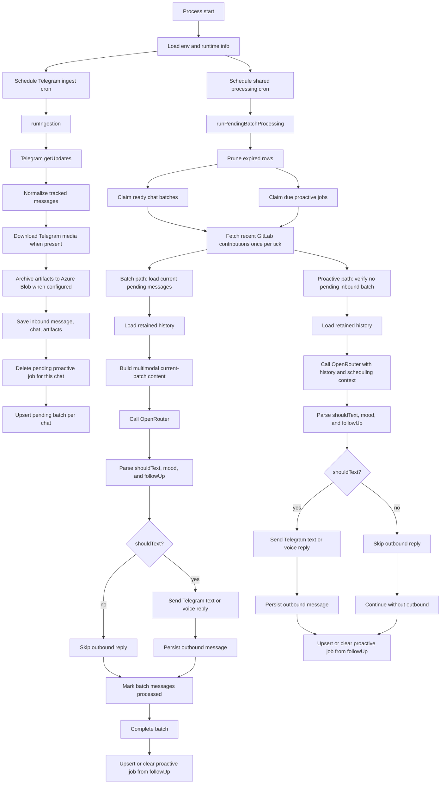
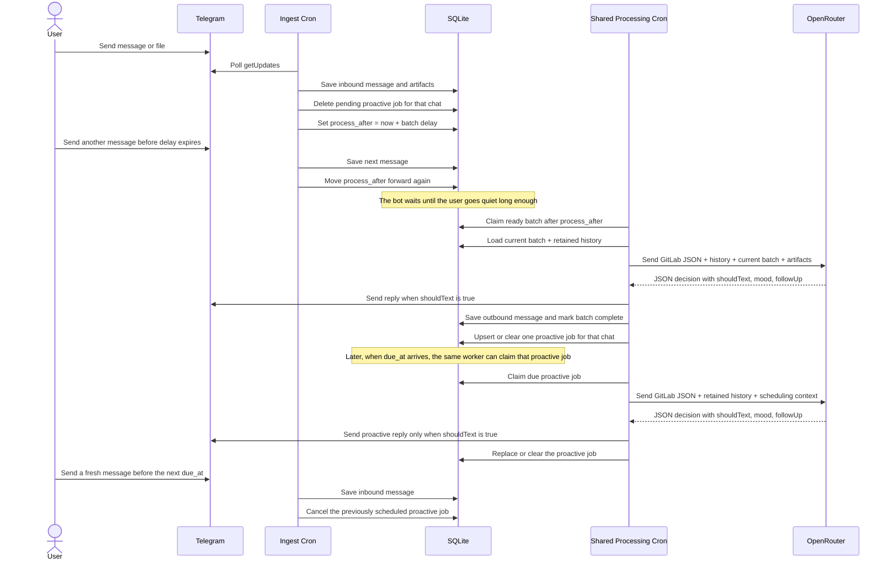

# Personal Telegram Bot System Flow

This document describes the current runtime as implemented in the codebase today. The bot ingests Telegram messages into SQLite, groups nearby inbound messages into batches, enriches prompt context with GitLab activity and retained chat history, asks OpenRouter for both an immediate reply decision and a future follow-up decision, and optionally delivers the result back to Telegram as text or as a native voice note.

## Runtime Overview

The runtime is a cron-driven Node.js process started from `index.js`.

- `index.js` schedules two loops: Telegram ingestion and a shared processing worker.
- `services/telegram.js` fetches Telegram updates, normalizes inbound messages, downloads file-backed media when needed, and sends outbound text or voice replies.
- `services/persistence.js` stores chats, messages, artifacts, pending batches, proactive follow-up jobs, and the last processed Telegram update id in SQLite.
- `services/storage.js` archives media to Azure Blob Storage and generates read URLs for model inputs when possible.
- `services/context.js` formats recent conversation history into prompt-friendly text.
- `services/media.js` converts current-batch artifacts into OpenRouter content parts such as text, image, generic file, and inline audio.
- `services/gitlab.js` fetches recent GitLab commits used as background context.
- `services/openrouter.js` builds the final model request and parses the JSON response.
- `services/speech.js` calls the OpenRouter speech endpoint and returns audio suitable for Telegram voice-note delivery after conversion.
- `services/time.js` formats AI-facing timestamps as Indonesian local time strings in `WIB`.

## End-to-End Flow



## User Journey

This section describes the same runtime from the user's point of view instead of the service point of view.



### What the user experiences

#### Journey A: User sends one message

1. The user sends a message in Telegram.
2. The next ingest tick stores it in SQLite and opens or updates that chat's pending batch.
3. The bot does not answer immediately. It waits for the batch delay window to expire.
4. When the processing cron sees that the batch is ready, it builds the full AI request.
5. The request includes the current unprocessed batch, retained conversation history, recent GitLab contribution data, and any persisted artifacts that can be attached.
6. The model decides whether to send a reply right now and whether to schedule a later follow-up.

#### Journey B: User sends several messages in a short burst

1. The first message starts a pending batch.
2. Each new message arriving before the delay expires pushes `process_after` forward.
3. The bot groups that burst into one AI call instead of replying message by message.
4. When the user stops long enough, the batch becomes ready.
5. The model sees the entire unprocessed burst as the current batch, plus prior retained history and GitLab context.

#### Journey C: The bot schedules a follow-up after replying

1. A batch or proactive analysis returns `followUp.shouldSchedule = true`.
2. The server computes `due_at` from the returned `delayMinutes` and upserts one row in `proactive_jobs` for that chat.
3. No extra cron is created. The normal processing worker will claim that job once it becomes due.
4. If the user sends a fresh message before then, ingestion deletes that pending proactive job and starts a new reactive batch instead.

#### Journey D: A scheduled proactive follow-up becomes due

1. The shared processing worker claims the due proactive job.
2. If there are new inbound messages waiting, the job is cleared so reactive processing wins.
3. Otherwise the worker loads retained history, GitLab activity, and the stored scheduling reason.
4. The model decides whether to proactively text now and whether another future follow-up should exist.

### Key timing rules

- `TELEGRAM_POLL_CRON` controls how often inbound Telegram updates are fetched.
- `TELEGRAM_PROCESS_CRON` controls how often the shared worker wakes up to process both ready user batches and due proactive jobs.
- `TELEGRAM_BATCH_DELAY_MS` controls how long a chat must stay quiet before reactive AI processing is allowed.
- The model returns `followUp.delayMinutes`, but the server computes the actual due timestamp in SQLite.
- Only one proactive job can exist per chat at a time because `proactive_jobs.chat_id` is the primary key.
- Fresh inbound activity cancels the pending proactive job for that same chat so scheduled outreach does not overlap with active conversation.

### Context included when a batch fires

When a chat batch is processed, the model sees all of these inputs together:

- the current batch of unprocessed inbound messages for that chat
- retained conversation history, currently 3 days by default
- GitLab contribution JSON for the configured lookback window
- multimodal artifact inputs when available
- the current Indonesian timestamp used as the prompt's time anchor

The current batch is removed from the history section before prompt assembly, so the same messages are not duplicated in both places.

## Detailed Flow

### 1. Startup and Scheduling

At startup, `index.js` loads environment variables, opens the SQLite runtime database through `services/persistence.js`, and registers two cron jobs.

- `TELEGRAM_POLL_CRON` defaults to `* * * * *`.
- `TELEGRAM_PROCESS_CRON` defaults to `* * * * *`.
- The runtime database defaults to `.runtime/personal-telegram-bot.sqlite`.
- Simple in-memory guards prevent overlapping ingest runs and overlapping processing runs in the same process.

### 2. Telegram Ingestion

Each ingest tick runs `ingestUpdates(batchDelayMs)`.

1. The runtime prunes expired rows before processing new input.
2. The bot reads the last processed Telegram `update_id` from SQLite.
3. It calls Telegram `getUpdates` with an offset of `lastUpdateId + 1`.
4. Only message updates are considered.
5. If `TELEGRAM_USERNAME` is configured, only messages from or for that username are tracked.
6. Each tracked update is normalized into a consistent internal message shape.
7. Saving an inbound message also deletes any pending proactive job for that chat and upserts the delayed batch row.

Normalized message fields include:

- chat identity and display name
- Telegram message id and update id
- sender metadata
- whether the sender is a bot
- detected message type such as `text`, `photo`, `document`, `voice`, `audio`, `video`, `sticker`, `location`, or `contact`
- extracted text or a readable fallback summary
- reply target id if present
- occurrence timestamp
- collected artifact metadata

### 3. Artifact Handling

When an inbound Telegram message contains file-backed media, the ingest path extracts artifact descriptors and attempts to archive them.

1. `services/telegram.js` resolves the Telegram file metadata and downloads the binary.
2. `services/storage.js` derives a summary-based filename from the message text.
3. The artifact is assigned a blob path in the form `YYYY-MM-DD/<summary>--<uniqueId>.<ext>`.
4. If Azure Blob Storage is configured, the binary is uploaded to the container.
5. If Azure is not configured, the artifact is still persisted with upload status metadata so the bot keeps a durable record.

Current storage behavior:

- storage provider: Azure Blob Storage when configured
- default container name: `personal-experiment`
- upload status examples: `uploaded`, `unconfigured`, `download_failed`, `upload_failed`

### 4. Persistence and Queues

The normalized inbound message is stored in SQLite by `saveInboundMessage(...)`.

Persistence currently keeps:

- `app_state` for values such as the last processed Telegram update id
- `chats` for chat metadata
- `messages` for inbound and outbound conversation records
- `artifacts` for persisted media metadata and archival state
- `pending_batches` for per-chat delayed reactive processing windows
- `proactive_jobs` for per-chat proactive follow-up scheduling

Queue behavior:

- `pending_batches` groups nearby inbound user messages into one AI call.
- `proactive_jobs` stores at most one active follow-up per chat, including `due_at`, `requested_delay_minutes`, `reason`, and `source`.
- New inbound messages push `process_after` forward and delete that chat's pending proactive job.
- Outbound bot messages are persisted immediately so later prompts include the bot's own conversation history.

### 5. Shared Processing Worker

Each processing tick runs `runPendingBatchProcessing()`.

1. Expired data is pruned first.
2. Ready chat batches are claimed from SQLite.
3. Due proactive jobs are also claimed from SQLite.
4. Recent GitLab contributions are fetched once for the whole tick.
5. The worker then processes claimed batches and claimed proactive jobs separately.

If the whole tick fails unexpectedly, claimed work is rescheduled instead of being dropped.

### 6. Reactive Batch Path

For each claimed batch:

1. The worker loads current unprocessed inbound messages for that chat.
2. If the batch is already empty, it completes the batch without calling the model.
3. Otherwise it loads retained recent history for the chat.
4. It builds multimodal current-batch content from text and artifacts.
5. It calls OpenRouter and receives a JSON decision.
6. If `shouldText` is true and `text` is non-empty, it sends the reply through Telegram.
7. The current batch messages are marked processed and the pending batch row is deleted.
8. The `followUp` decision is then used to upsert or clear the chat's proactive job.

### 7. Proactive Follow-Up Path

For each claimed proactive job:

1. The worker checks whether new inbound messages are waiting for that chat.
2. If a reactive batch is pending, the proactive job is cleared so the reactive path wins.
3. If no retained history is available, the proactive job is cleared.
4. Otherwise the worker calls OpenRouter with retained history, GitLab activity, and scheduling context describing why this follow-up exists.
5. If `shouldText` is true and `text` is non-empty, it sends the proactive reply through Telegram.
6. The `followUp` decision from that analysis replaces or clears the proactive job.

### 8. Prompt and Multimodal Assembly

The AI request is split into two major context sources.

System prompt content includes:

- GitLab activity as JSON
- the current Indonesian date and time
- scheduling context describing whether the call was triggered by a user batch or a due proactive follow-up
- working schedule placeholder text
- recent 3-day conversation history formatted as timestamped `user` and `assistant` lines
- an explicit rule that all timestamps shown to the model are already in Indonesian local time (`WIB`)
- instructions to return only JSON with `shouldText`, `text`, `mood`, and `followUp`

User content includes:

- a text preface for the current batch
- one formatted line per current-batch message
- multimodal artifact parts when available

Artifact-to-model mapping in `services/media.js`:

- images are sent as `image` parts using signed Azure URLs
- uploaded non-audio files are sent as `file` parts using signed Azure URLs
- audio and voice are downloaded from Telegram again at processing time and sent inline as binary `file` parts because OpenRouter audio inputs cannot use remote URLs
- when an artifact cannot be attached, a text fallback is appended so the model still sees that the artifact existed

### 9. OpenRouter Decision Step

`services/openrouter.js` sends the assembled request to OpenRouter using the `google/gemini-3-flash-preview` chat model.

Expected normalized model output:

```json
{
  "shouldText": true,
  "text": "Message to send back to Telegram",
  "mood": "empathetic",
  "followUp": {
    "shouldSchedule": true,
    "delayMinutes": 45,
    "reason": "Check back later if the conversation stays quiet"
  }
}
```

The bot strips any surrounding Markdown fences, parses the JSON, normalizes missing or malformed follow-up fields, and uses:

- `shouldText` and `text` to decide whether to send a reply now
- `mood` to shape optional TTS delivery style
- `followUp` to decide whether to create, replace, or clear a proactive job

### 10. Telegram Delivery and Outbound Logging

When the model decides to reply, `services/telegram.js` sends the message through `sendTelegramMessage(...)`.

Outbound delivery behavior:

- text replies use Telegram `sendMessage`
- voice replies use the OpenRouter speech API, request PCM audio, convert it to Telegram-friendly OGG/Opus, and send it with `sendVoice`
- delivery mode is selected by `TELEGRAM_VOICE_REPLY_CHANCE` unless explicitly overridden in code
- outbound messages are normalized and persisted in SQLite so future prompts include the bot's own conversation history
- voice replies persist the spoken transcript as `messages.text_content`

When the model decides not to reply:

- no Telegram message is sent
- the batch is still completed when the trigger was a reactive batch
- the proactive job is still replaced or cleared based on `followUp`

### 11. Retention and Recovery Behavior

The persistence layer keeps a rolling history window.

- default retention is 3 days
- expired message rows are pruned during ingest and processing ticks
- old pending batches are also pruned
- old proactive jobs are pruned
- stale `processing` batches are reset back to `pending` after a timeout so the system can recover from interrupted runs
- stale `processing` proactive jobs are also reset back to `pending`

## External Integrations

### Telegram

- reads inbound updates via `getUpdates`
- downloads media via `getFile` plus Telegram file URLs
- sends outbound text via `sendMessage`
- sends outbound native voice notes via `sendVoice`

### Azure Blob Storage

- stores archived media artifacts when configured
- provides signed read URLs for image and generic file model inputs

### GitLab

- fetches recent commit activity for the configured user
- contribution data is passed to the model as JSON, not as a prose summary

### OpenRouter

- receives the system prompt, recent history, current batch, scheduling context, and multimodal parts
- returns a JSON decision describing whether the bot should text now and whether a future follow-up should be scheduled
- provides the speech synthesis endpoint used for optional Telegram voice-note replies

## Important Runtime Configuration

- `TELEGRAM_BOT_TOKEN`: required for Telegram API access
- `TELEGRAM_USERNAME`: optional filter for tracked messages
- `TELEGRAM_FETCH_LIMIT`: maximum updates requested per poll
- `TELEGRAM_POLL_CRON`: ingest schedule
- `TELEGRAM_PROCESS_CRON`: shared worker schedule for both reactive batches and proactive jobs
- `TELEGRAM_BATCH_DELAY_MS`: quiet window before a pending chat batch becomes processable
- `TELEGRAM_CHUNK_DELAY_MS`: delay between outbound chunks when a long reply is split
- `TELEGRAM_VOICE_REPLY_CHANCE`: probability of sending a voice reply instead of text
- `OPENROUTER_API_KEY`: required for AI calls
- `OPENROUTER_TTS_MODEL`: speech model used for voice replies
- `OPENROUTER_TTS_VOICE`: default speech voice
- `OPENROUTER_TTS_RESPONSE_FORMAT`: speech format, currently `pcm`
- `OPENROUTER_TTS_SPEED`: speech speed multiplier
- `GITLAB_TOKEN`, `GITLAB_USERNAME`, `GITLAB_HOST`: GitLab integration settings
- `GITLAB_LOOKBACK_DAYS`: contribution lookback window, default `1`
- `AZURE_STORAGE_CONNECTION_STRING`: enables artifact upload and signed URLs
- `AZURE_STORAGE_CONTAINER_NAME`: optional container override, default `personal-experiment`
- `MESSAGE_RETENTION_DAYS`: retained history window, default `3`
- `RUNTIME_DATA_DIR`: optional runtime directory override
- `DEBUG_LOGS`: enables debug logging across scheduler, Telegram, GitLab, OpenRouter, and speech paths

## Current System Notes

- Conversation history sent to the model excludes the current unprocessed batch so the same inbound messages are not duplicated in both history and current inputs.
- AI-facing timestamps in conversation history and GitLab contribution data are formatted as `YYYY-MM-DD HH:mm:ss WIB`.
- The system prompt always includes the current Indonesian date and time as an anchor so the model can reason about sleep, morning wakeups, and timeline order correctly.
- Fresh inbound user activity cancels any pending proactive follow-up for that chat before a new reactive batch is scheduled.
- Only one proactive follow-up row can exist per chat at a time, which prevents overlap and keeps rescheduling simple.
- Optional voice replies use the analysis `mood` as speech-style guidance, not as the speech voice id itself.